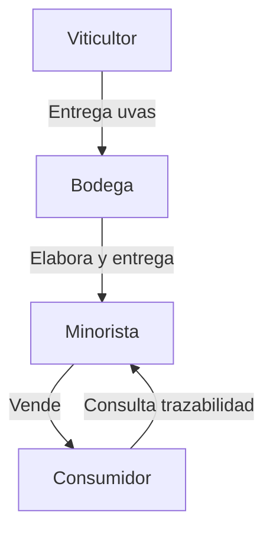

# pfm-traza-hlf-2025

Plataforma descentralizada basada en Hyperledger Fabric que permite la trazabilidad completa de productos desde su origen hasta el consumidor final, utilizando registros digitales para representar materias primas y productos terminados.

---

## Diagrama general



---

## Tabla de actores y permisos

<table>
  <thead>
    <tr>
      <th>Actor</th>
      <th>Rol en la red</th>
      <th>Permisos principales</th>
    </tr>
  </thead>
  <tbody>
    <tr>
      <td><strong>Viticultor</strong></td>
      <td>Cultiva las uvas</td>
      <td>Registrar cosecha, datos de parcela, insumos utilizados</td>
    </tr>
    <tr>
      <td><strong>Bodega</strong></td>
      <td>Elabora el vino</td>
      <td>Registrar producción, análisis químicos, embotellado</td>
    </tr>

    <tr>
      <td><strong>Minorista</strong></td>
      <td>Punto de venta final</td>
      <td>Registrar disponibilidad, confirmar trazabilidad para consumidor</td>
    </tr>
    <tr>
      <td><strong>Consumidor (lectura)</strong></td>
      <td>Escanea QR o accede desde app móvil</td>
      <td>Solo lectura de datos trazables de una botella específica</td>
    </tr>
  </tbody>
</table>

---

## Descripción general

Esta plataforma permite:
- Registrar digitalmente cada etapa de la cadena de suministro.
- Garantizar la autenticidad y trazabilidad de los productos.
- Facilitar la consulta de información por parte de los consumidores.
- Integrar sensores IoT y datos de calidad en tiempo real.

Cada actor tiene permisos específicos y todas las acciones quedan registradas de forma inmutable en la blockchain de Hyperledger Fabric.

---

## Funcionalidades Clave

### 1. Gestión de Identidad
- Cada participante se identifica mediante certificados X.509
- El MSP (Membership Service Provider) gestiona las identidades
- Control de acceso basado en roles mediante políticas de endorsement
- Autenticación mediante Fabric CA

### 2. Registro de Activos
- **Materias Primas:**
  - Registros únicos para cada lote de materia prima
  - Metadata asociada (origen, características, certificaciones)
  - Trazabilidad desde el origen
- **Productos:**
  - Registros únicos para productos terminados
  - Vinculación con registros de materias primas utilizadas
  - Información del proceso de transformación

### 3. Sistema de Transferencias
- Transferencias direccionales según rol
- Sistema de aceptación/rechazo de transferencias
- Validación mediante políticas de endorsement

### 4. Trazabilidad
- Registro completo del ciclo de vida
- Visualización de la cadena de custodia
- Verificación de autenticidad
- Historia completa de transferencias

---

## Instrucciones de despliegue

1. **Clona el repositorio:**
   ```sh
   git clone <URL-del-repositorio>
   cd pfm-traza-hlf-2025
   ```
2. **Instala dependencias en los módulos principales:**
   ```sh
   cd chaincode && npm install
   cd ../api && npm install
   cd ../metamask/supplychain-tracker && npm install
   ```
3. **Despliega la red de Hyperledger Fabric:**
   - Sigue las instrucciones del directorio `fabric-samples` o usa los scripts de red incluidos.
4. **Compila y ejecuta el chaincode en modo externo:**
   ```sh
   cd chaincode
   npm run start:external
   ```
5. **Arranca la API:**
   ```sh
   cd ../api
   npm start
   ```
6. **Arranca la aplicación web (Next.js):**
   ```sh
   cd ../metamask/supplychain-tracker
   npm run dev
   ```
7. **Accede a la plataforma:**
   - API: http://localhost:5551
   - Web: http://localhost:3000

Asegúrate de tener Docker y Node.js instalados. Consulta la documentación de cada subproyecto para detalles avanzados.